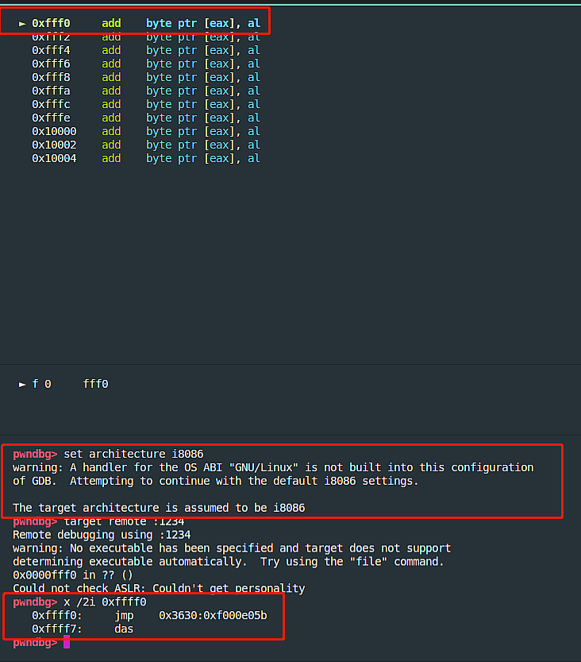
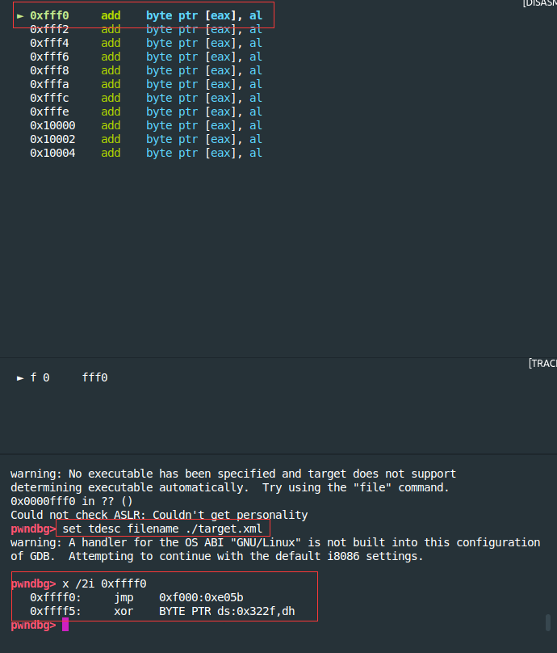
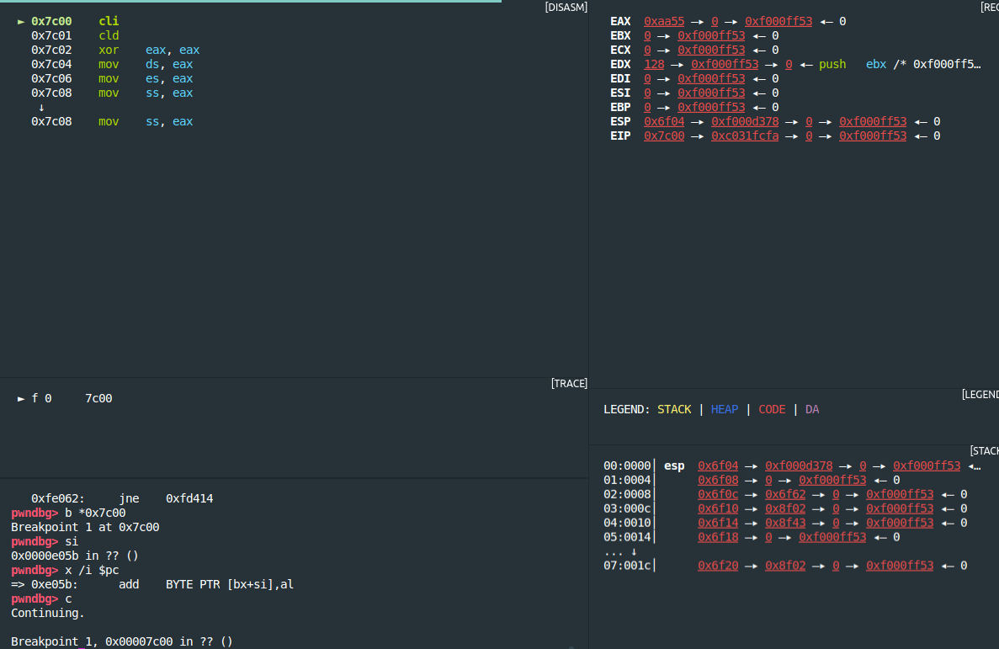
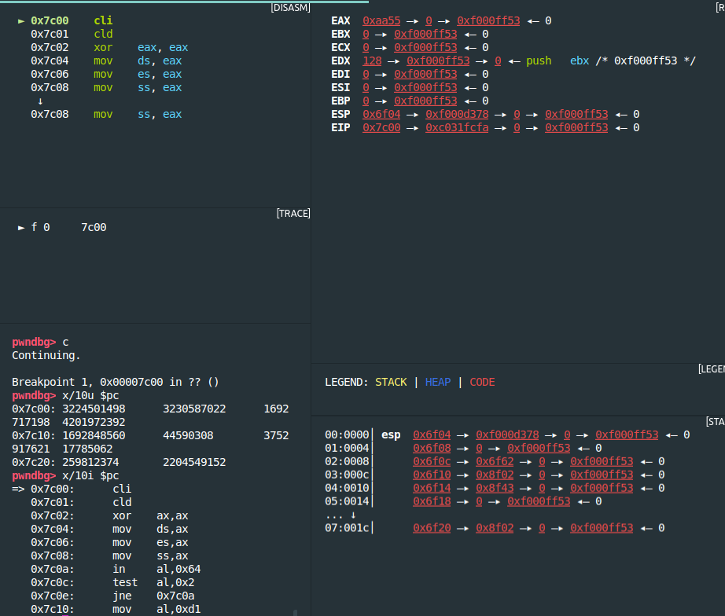
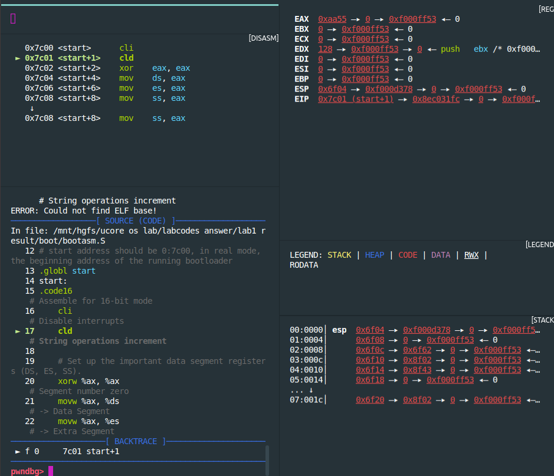

# 实验报告
## [练习1]

[练习1.1]
#### 操作系统镜像文件 ucore.img 是如何一步一步生成的？
#### (需要比较详细地解释 Makefile 中每一条相关命令和命令参数的含义，以及说明命令导致的结果)

* ##### 注意事项  
  1. 可以通过tools下的function.md查看call中函数的功能  
  2. 以下有一些命令补充

* ##### 一些命令的补充  

1. |ld:用于将目标文件与库链接为可执行程序或库文件  
2. |dd:用指定大小的块拷贝一个文件，并在拷贝的同时进行指定的转换  
* (1) if=:即inputfile=,指定源文件,默认为标准输入  
* (2) of=:即outputfile=,指定目标文件,默认为标准输出  
* (3) ibs=bytes:一次读入bytes个字节，即指定一个块大小为bytes个字节,默认为512  
* (4) count=blocks:仅拷贝blocks个块，块大小等于ibs指定的字节数  
* (5) conv=\<keywords\>:  
* *  notrunc:表示不截短输出文件
      如果在dd 后面加上 conv=notrunc，如果输出文件存在的并且新的输出文件比原输出文件小,  
      则新的输入文件会覆盖原文件的前面的部分。如果不加这个选项，那么在上述情况下，  
      原文件比新文件多出来的内容会被截断，这就是trunc的含义。  
3. \$@:目标文件  
4. \$^:所有的依赖文件  
5. \$<:第一个依赖文件

* ##### 重要函数记录

1. eval:	把其后的text当做makefile语句再执行一次  
2. $(patsubst \<pattern\>,\<replacement\>,\<text\>):
```
      if(eq(pattern,text))  
          text = replacemnt;  
      #方便对一系列文件进行一个统一操作,例如替换后缀,增加前缀
```
3. ...剩下的注释在function.mk上了
  

```
bin/ucore.img
| 生成ucore.img的代码如下
| UCOREIMG	:= $(call totarget,ucore.img)         #UCOREIMG即 bin/ucore.img  
|
| $(UCOREIMG): $(kernel) $(bootblock)                 #UCOREIMG依赖于两个变量:kernel和bootblock  
|	$(V)dd if=/dev/zero of=$@ count=10000         #生成一个有10000个512字节的0填充块的文件ucore.img  
|	$(V)dd if=$(bootblock) of=$@ conv=notrunc     #将bootbloc(512字节)写入ucore.img且不截断原输出文件多余内容  
|	$(V)dd if=$(kernel) of=$@ seek=1 conv=notrunc #从输出文件开头跳过1个块后再开始写入kernel  
| $(call create_target,ucore.img)	              #创建目标ucore.img
| 
|> bin/kernel
|	| 生成kernel的代码:
|	| kernel = $(call totarget,kernel)            
|	| $(kernel): tools/kernel.ld                  #kernel依赖链接脚本kernel.ld,以及kernel libs
|	| $(kernel): $(KOBJS)                         #KOBJS	= $(call read_packet,kernel libs)
|	|	@echo + ld $@	                      #将kernel与库链接
|	|	#通过make "V="可以看到具体干了什么,-T是指定链接的脚本
|	|	$(V)$(LD) $(LDFLAGS) -T tools/kernel.ld -o $@ $(KOBJS)	
|	|	@$(OBJDUMP) -S $@ > $(call asmfile,kernel)				
|	|	@$(OBJDUMP) -t $@ | $(SED) '1,/SYMBOL TABLE/d; s/ .* / /; /^$$/d' > $(call symfile,kernel)
|	|		//上两句只是替换了一系列suffix,生成汇编,符号表啥的,~~似乎无关紧要~~
|	| $(call create_target,kernel)                #创建目标kernel
|	|
|	| 通过make "V="发现KOBJS 对应一系列.o文件,这些文件如何生成呢?
|	| 可以看到在+ ld之前有一系列的中间文件生成,对应的语句为:
|	| 	$(call add_files_cc,$(call listf_cc,$(KSRCDIR)),kernel,$(KCFLAGS))  
|	|
|	|	#add_files_cc = $(call add_files,$(1),$(CC),$(CFLAGS) $(3),$(2),$(4)
|	|	#其实这里就是对依赖的文件和目标文件,补充prefix或者suffix(packetname、命令名(-o)等)
|	|	#然后再执行shell语句,这样就完成了obj_file的生成
|	|       #至此,基本是生成kernel的逻辑就厘清了,还是先编译生成obj_file,然后再把linking生成kernel
|	|	#主要是中间使用了一系列的函数对文件的前后缀进行更改、模式匹配替换、查找、还有一些shell命令
|	|	#涉及了许多细节的东西,有时候真的得一个选项一个函数慢慢查,让初学者看起来眼花缭乱且搞心态.
|	| 
|
|> bin/bootblock
|	| 生成bootblock的代码
|	| bootfiles = $(call listf_cc,boot)                 #listf_cc = $(call listf,$(1),$(CTYPE)),CTYPE	:= c S
|	| $(foreach f,$(bootfiles),$(call cc_compile,$(f),$(CC),$(CFLAGS) -Os -nostdinc))
|	|	                                            #逐一读出bootfiles后编译
|	| bootblock = $(call totarget,bootblock)	    
|	|
|	| $(bootblock): $(call toobj,$(bootfiles)) | $(call totarget,sign)	#bootblock依赖sign和bootfiles
|	| 	@echo + ld $@			            #将bootblock与库链接
|	|   # 该命令就是设置了bootblock的文件格式、文件权限、程序入口点
|	|   # LDFLAGS其实是确定了二进制可执行文件的格式.
|	|   # -N 表示将text和data区设置为可读可写的,并禁止对共享库的链接、页面对齐
|	|   # -e 明确了使用"entry"作为程序的入口点。"entry"就是后面跟着的symbol:"start"
|	|   # start -Ttext 0x7C00 设置开始的地址为0x7C00
|	|	$(V)$(LD) $(LDFLAGS) -N -e start -Ttext 0x7C00 $^ -o $(call toobj,bootblock)
|	|	
|	|	@$(OBJDUMP) -S $(call objfile,bootblock) > $(call asmfile,bootblock)
|	|	@$(OBJCOPY) -S -O binary $(call objfile,bootblock) $(call outfile,bootblock)
|	|
|	|	#↑用到了bin/sign------补充:其实是通过sign工具处理bootblock.out生成bootblock
|	|
|	|	@$(call totarget,sign) $(call outfile,bootblock) $(bootblock)
|	|
|	|>obj/boot/bootasm.o, obj/boot/bootmain.o
|	|	| 生成bootasm.o需要bootasm.S
|	|	| 实际命令为
|	|	| gcc -Iboot/ -fno-builtin -Wall -ggdb -m32 -gstabs \
|	|	| 	-nostdinc  -fno-stack-protector -Ilibs/ -Os -nostdinc \
|	|	| 	-c boot/bootasm.S -o obj/boot/bootasm.o
|	|	| 其中关键的参数为
|	|	| 	-ggdb  生成可供gdb使用的调试信息。这样才能用qemu+gdb来调试bootloader or ucore。
|	|	|	-m32  生成适用于32位环境的代码。我们用的模拟硬件是32bit的80386，所以ucore也要是32位的软件。
|	|	| 	-gstabs  生成stabs格式的调试信息。这样要ucore的monitor可以显示出便于开发者阅读的函数调用栈信息
|	|	| 	-nostdinc  不使用标准库。标准库是给应用程序用的，我们是编译ucore内核，OS内核是提供服务的，所以所有的服务要自给自足。
|	|	|	-fno-stack-protector  不生成用于检测缓冲区溢出的代码。这是for 应用程序的，我们是编译内核，ucore内核好像还用不到此功能。
|	|	| 	-Os  为减小代码大小而进行优化。根据硬件spec，主引导扇区只有512字节，我们写的简单bootloader的最终大小不能大于510字节。
|	|	| 	-I<dir>  添加搜索头文件的路径
|	|	| 
|	|	| 生成bootmain.o需要bootmain.c
|	|	| 实际命令为
|	|	| gcc -Iboot/ -fno-builtin -Wall -ggdb -m32 -gstabs -nostdinc \
|	|	| 	-fno-stack-protector -Ilibs/ -Os -nostdinc \
|	|	| 	-c boot/bootmain.c -o obj/boot/bootmain.o
|	|	| 新出现的关键参数有
|	|	| 	-fno-builtin  除非用__builtin_前缀，
|	|	|	              否则不进行builtin函数的优化
|	|
|	| $(call create_target,bootblock)
|	| 
|	|> bin/sign
|	| sign的生成语句如下
|	|	#其实就是编译sign.c
|	| #$(call add_files_host,tools/sign.c,sign,sign)
|	| #$(call create_target_host,sign,sign)
|


```

[练习1.2]
#### 一个被系统认为是符合规范的硬盘主引导扇区的特征是什么？
##### 答:只有512字节且倒数的第二个字节为0x55,倒数第一个字节为0xAA

## [练习2]

[练习2.1]

#### 从 CPU 加电后执行的第一条指令开始，单步跟踪 BIOS 的执行。  

``` 

| make debug命令如下  
| |  
| |debug: \$(UCOREIMG)
| | \$(V)$() -S -s -parallel stdio -hda $< -serial null &  
| |	\$(V)sleep 2QEMU  	
| |	\$(V)$(TERMINAL) -e "gdb -q -tui -x tools/gdbinit"  
| |
| 

```  
但我想使用pwndbg + hyperpwn来调试,命令如下:
```
shell>qemu -S -s -hda ./bin/ucore.img -monitor stdio  
#新开一个终端
shell>gdb
pwndgb>set architecture i8086  
pwndgb>target remote :1234  
```  
但是gdb似乎无法在i8086下进行调试?  
    
&emsp;经过搜索发现有人和我遇到一样的问题:  
&emsp;https://bugs.launchpad.net/qemu/+bug/1686170/comments/4  
&emsp;将set arch i8086改成set tdesc filename ./target.xml  
  


[练习2.2]
#### 2.在初始化位置 0x7c00 设置实地址断点,测试断点正常。  
接上:
```
gdb>b *0x7c00  
gdb>continue  
```
   

[练习2.3]  
#### 3.从 0x7c00 开始跟踪代码运行,将单步跟踪反汇编得到的代码与 bootasm.S 和 bootblock.asm 进行比较:  

##### 在调用qemu时添加 -d in_asm -D q.log,可以将运行得到的汇编指令保存在q.log中  
##### 似乎是由于问题1并没有完全解决,导致打印出来的q.log有差异  
##### gdb>x /10i $pc 打印出来的指令是与bootasm.S/.asm一致的  


  

[练习2.4]  
#### 4.自己找一个 bootloader 或内核中的代码位置，设置断点并进行测试。  
**测试bootmain:**
```
gdb>file obj/bootblock.o  #加载符号表
gdb>b bootmain            #设置断点
gdb>c
```


## [练习3]

#### BIOS 将通过读取硬盘主引导扇区到内存，并转跳到对应内存中的位置执行 bootloader。  
#### 请分析 bootloader 是如何完成从实模式进入保护模式的。
#### 需要阅读小节“保护模式和分段机制(手册:4、6、9、10+5、7、8)”和 lab1/boot/bootasm.S 源码，  
#### 了解如何从实模式切换到保护模式，需要了解：  
---
##### 1.为何开启 A20，以及如何开启?  
  因为80186的遗留问题:可表示的寻址范围超出1M,超出部分需要memory wrapping,  
  导致新的机器无法连续访存\(A20不开启,地址线20位永远是0\)。  
  开启方式是:  使用8042键盘控制器
##### 2.如何初始化 GDT(global-descriptor-table全局描述符表)  
```
  lgdt gdtdesc
```
##### 3.如何使能和进入保护模式  
```
  使能:将cr0最低位置为1,\(应该要触发某个引脚?\)
  进入保护模式:
    (1)打开A20 Gate
    (2)使能
    (3)跳转
```
---

##### bootasm.S分析
---
1.cli禁止中断  
```
    cli
```
2.环境清理,将flag(DS,ES,SS)和段寄存器ax置0  
```
    xorw %ax, %ax                                   
    movw %ax, %ds                                   
    movw %ax, %es                                   
    movw %ax, %ss 
```
3.开启A20 Gate

```
seta20.1:
    inb $0x64, %al       #等待 8042 Input buffer 为空                           
    testb $0x2, %al
    jnz seta20.1

    movb $0xd1, %al      #发送 Write 8042 Output Port(P2端口)                          
    outb %al, $0x64      #命令到 842 Input buffer                           

seta20.2:
    inb $0x64, %al       #等待 8042 Input buffer 为空                            
    testb $0x2, %al
    jnz seta20.2

    movb $0xdf, %al      #将P2的A20位置为1                           
    outb %al, $0x60      #outb表示输出到端口?
#为什么要等待两次?因为4发送指令,此时缓存区非空,空即证明指令被读取

```
4.加载gdt
```
    lgdt gdtdesc
```
5.将cr0的PE位置为1进入保护模式
```
    movl %cr0, %eax
    orl $CR0_PE_ON, %eax
    movl %eax, %cr0
```
6.通过跳转到protcseg初始化保护模式堆栈
```
    ljmp $PROT_MODE_CSEG, $protcseg
protcseg:
    movw $PROT_MODE_DSEG, %ax                       
    movw %ax, %ds                                 
    movw %ax, %es                                 
    movw %ax, %fs                                 
    movw %ax, %gs                                   
    movw %ax, %ss                                   
```
7.将栈指针指向0x7c00,然后跳转到bootmain
```
    movl $0x0, %ebp
    movl $start, %esp
    call bootmain
```

---

