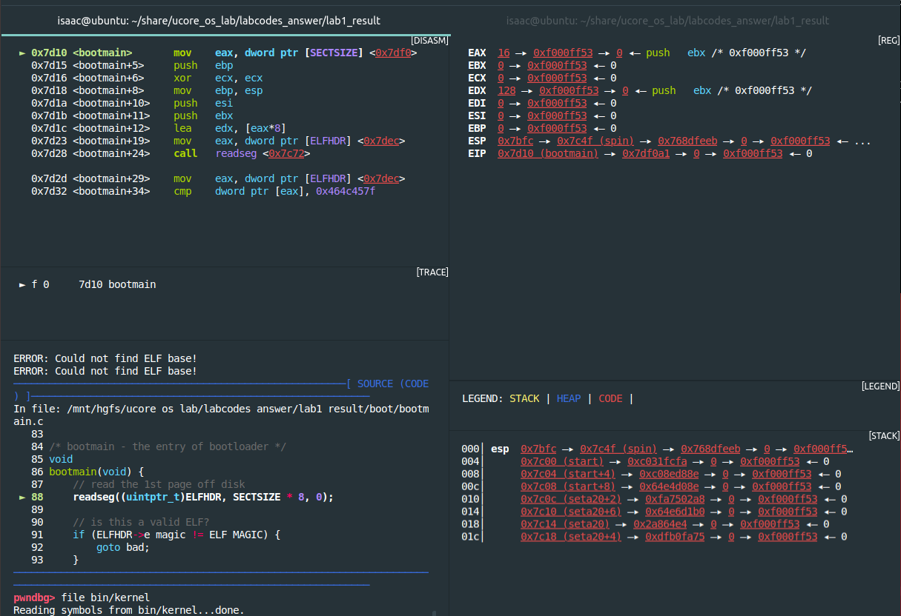
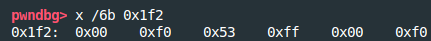
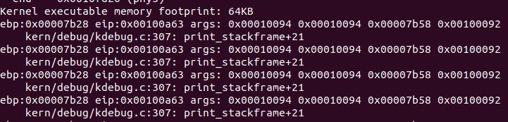
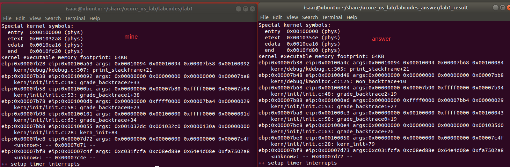

# 实验报告
## [练习1]

[练习1.1]
#### 操作系统镜像文件 ucore.img 是如何一步一步生成的？
#### (需要比较详细地解释 Makefile 中每一条相关命令和命令参数的含义，以及说明命令导致的结果)

* ##### 注意事项  
  1. 可以通过tools下的function.md查看call中函数的功能  
  2. 以下有一些命令补充

* ##### 一些命令的补充  

1. |ld:用于将目标文件与库链接为可执行程序或库文件  
2. |dd:用指定大小的块拷贝一个文件，并在拷贝的同时进行指定的转换  
* (1) if=:即inputfile=,指定源文件,默认为标准输入  
* (2) of=:即outputfile=,指定目标文件,默认为标准输出  
* (3) ibs=bytes:一次读入bytes个字节，即指定一个块大小为bytes个字节,默认为512  
* (4) count=blocks:仅拷贝blocks个块，块大小等于ibs指定的字节数  
* (5) conv=\<keywords\>:  
* *  notrunc:表示不截短输出文件
      如果在dd 后面加上 conv=notrunc，如果输出文件存在的并且新的输出文件比原输出文件小,  
      则新的输入文件会覆盖原文件的前面的部分。如果不加这个选项，那么在上述情况下，  
      原文件比新文件多出来的内容会被截断，这就是trunc的含义。  
3. \$@:目标文件  
4. \$^:所有的依赖文件  
5. \$<:第一个依赖文件

* ##### 重要函数记录

1. eval:	把其后的text当做makefile语句再执行一次  
2. $(patsubst \<pattern\>,\<replacement\>,\<text\>):
```
      if(eq(pattern,text))  
          text = replacemnt;  
      #方便对一系列文件进行一个统一操作,例如替换后缀,增加前缀
```
3. ...剩下的注释在function.mk上了
  

```
bin/ucore.img
| 生成ucore.img的代码如下
| UCOREIMG	:= $(call totarget,ucore.img)         #UCOREIMG即 bin/ucore.img  
|
| $(UCOREIMG): $(kernel) $(bootblock)                 #UCOREIMG依赖于两个变量:kernel和bootblock  
|	$(V)dd if=/dev/zero of=$@ count=10000         #生成一个有10000个512字节的0填充块的文件ucore.img  
|	$(V)dd if=$(bootblock) of=$@ conv=notrunc     #将bootbloc(512字节)写入ucore.img且不截断原输出文件多余内容  
|	$(V)dd if=$(kernel) of=$@ seek=1 conv=notrunc #从输出文件开头跳过1个块后再开始写入kernel  
| $(call create_target,ucore.img)	              #创建目标ucore.img
| 
|> bin/kernel
|	| 生成kernel的代码:
|	| kernel = $(call totarget,kernel)            
|	| $(kernel): tools/kernel.ld                  #kernel依赖链接脚本kernel.ld,以及kernel libs
|	| $(kernel): $(KOBJS)                         #KOBJS	= $(call read_packet,kernel libs)
|	|	@echo + ld $@	                      #将kernel与库链接
|	|	#通过make "V="可以看到具体干了什么,-T是指定链接的脚本
|	|	$(V)$(LD) $(LDFLAGS) -T tools/kernel.ld -o $@ $(KOBJS)	
|	|	@$(OBJDUMP) -S $@ > $(call asmfile,kernel)				
|	|	@$(OBJDUMP) -t $@ | $(SED) '1,/SYMBOL TABLE/d; s/ .* / /; /^$$/d' > $(call symfile,kernel)
|	|		//上两句只是替换了一系列suffix,生成汇编,符号表啥的,~~似乎无关紧要~~
|	| $(call create_target,kernel)                #创建目标kernel
|	|
|	| 通过make "V="发现KOBJS 对应一系列.o文件,这些文件如何生成呢?
|	| 可以看到在+ ld之前有一系列的中间文件生成,对应的语句为:
|	| 	$(call add_files_cc,$(call listf_cc,$(KSRCDIR)),kernel,$(KCFLAGS))  
|	|
|	|	#add_files_cc = $(call add_files,$(1),$(CC),$(CFLAGS) $(3),$(2),$(4)
|	|	#其实这里就是对依赖的文件和目标文件,补充prefix或者suffix(packetname、命令名(-o)等)
|	|	#然后再执行shell语句,这样就完成了obj_file的生成
|	|       #至此,基本是生成kernel的逻辑就厘清了,还是先编译生成obj_file,然后再把linking生成kernel
|	|	#主要是中间使用了一系列的函数对文件的前后缀进行更改、模式匹配替换、查找、还有一些shell命令
|	|	#涉及了许多细节的东西,有时候真的得一个选项一个函数慢慢查,让初学者看起来眼花缭乱且搞心态.
|	| 
|
|> bin/bootblock
|	| 生成bootblock的代码
|	| bootfiles = $(call listf_cc,boot)                 #listf_cc = $(call listf,$(1),$(CTYPE)),CTYPE	:= c S
|	| $(foreach f,$(bootfiles),$(call cc_compile,$(f),$(CC),$(CFLAGS) -Os -nostdinc))
|	|	                                            #逐一读出bootfiles后编译
|	| bootblock = $(call totarget,bootblock)	    
|	|
|	| $(bootblock): $(call toobj,$(bootfiles)) | $(call totarget,sign)	#bootblock依赖sign和bootfiles
|	| 	@echo + ld $@			            #将bootblock与库链接
|	|   # 该命令就是设置了bootblock的文件格式、文件权限、程序入口点
|	|   # LDFLAGS其实是确定了二进制可执行文件的格式.
|	|   # -N 表示将text和data区设置为可读可写的,并禁止对共享库的链接、页面对齐
|	|   # -e 明确了使用"entry"作为程序的入口点。"entry"就是后面跟着的symbol:"start"
|	|   # start -Ttext 0x7C00 设置开始的地址为0x7C00
|	|	$(V)$(LD) $(LDFLAGS) -N -e start -Ttext 0x7C00 $^ -o $(call toobj,bootblock)
|	|	
|	|	@$(OBJDUMP) -S $(call objfile,bootblock) > $(call asmfile,bootblock)
|	|	@$(OBJCOPY) -S -O binary $(call objfile,bootblock) $(call outfile,bootblock)
|	|
|	|	#↑用到了bin/sign------补充:其实是通过sign工具处理bootblock.out生成bootblock
|	|
|	|	@$(call totarget,sign) $(call outfile,bootblock) $(bootblock)
|	|
|	|>obj/boot/bootasm.o, obj/boot/bootmain.o
|	|	| 生成bootasm.o需要bootasm.S
|	|	| 实际命令为
|	|	| gcc -Iboot/ -fno-builtin -Wall -ggdb -m32 -gstabs \
|	|	| 	-nostdinc  -fno-stack-protector -Ilibs/ -Os -nostdinc \
|	|	| 	-c boot/bootasm.S -o obj/boot/bootasm.o
|	|	| 其中关键的参数为
|	|	| 	-ggdb  生成可供gdb使用的调试信息。这样才能用qemu+gdb来调试bootloader or ucore。
|	|	|	-m32  生成适用于32位环境的代码。我们用的模拟硬件是32bit的80386，所以ucore也要是32位的软件。
|	|	| 	-gstabs  生成stabs格式的调试信息。这样要ucore的monitor可以显示出便于开发者阅读的函数调用栈信息
|	|	| 	-nostdinc  不使用标准库。标准库是给应用程序用的，我们是编译ucore内核，OS内核是提供服务的，所以所有的服务要自给自足。
|	|	|	-fno-stack-protector  不生成用于检测缓冲区溢出的代码。这是for 应用程序的，我们是编译内核，ucore内核好像还用不到此功能。
|	|	| 	-Os  为减小代码大小而进行优化。根据硬件spec，主引导扇区只有512字节，我们写的简单bootloader的最终大小不能大于510字节。
|	|	| 	-I<dir>  添加搜索头文件的路径
|	|	| 
|	|	| 生成bootmain.o需要bootmain.c
|	|	| 实际命令为
|	|	| gcc -Iboot/ -fno-builtin -Wall -ggdb -m32 -gstabs -nostdinc \
|	|	| 	-fno-stack-protector -Ilibs/ -Os -nostdinc \
|	|	| 	-c boot/bootmain.c -o obj/boot/bootmain.o
|	|	| 新出现的关键参数有
|	|	| 	-fno-builtin  除非用__builtin_前缀，
|	|	|	              否则不进行builtin函数的优化
|	|
|	| $(call create_target,bootblock)
|	| 
|	|> bin/sign
|	| sign的生成语句如下
|	|	#其实就是编译sign.c
|	| #$(call add_files_host,tools/sign.c,sign,sign)
|	| #$(call create_target_host,sign,sign)
|


```

[练习1.2]
#### 一个被系统认为是符合规范的硬盘主引导扇区的特征是什么？
##### 答:只有512字节且倒数的第二个字节为0x55,倒数第一个字节为0xAA

## [练习2]

[练习2.1]

#### 从 CPU 加电后执行的第一条指令开始，单步跟踪 BIOS 的执行。  

``` 

| make debug命令如下  
| |  
| |debug: \$(UCOREIMG)
| | \$(V)$() -S -s -parallel stdio -hda $< -serial null &  
| |	\$(V)sleep 2QEMU  	
| |	\$(V)$(TERMINAL) -e "gdb -q -tui -x tools/gdbinit"  
| |
| 

```  
但我想使用pwndbg + hyperpwn来调试,命令如下:
```
shell>qemu -S -s -hda ./bin/ucore.img -monitor stdio  
#新开一个终端
shell>gdb
pwndgb>set architecture i8086  
pwndgb>target remote :1234  
```  
但是gdb似乎无法在i8086下进行调试?  
    
&emsp;经过搜索发现有人和我遇到一样的问题:  
&emsp;https://bugs.launchpad.net/qemu/+bug/1686170/comments/4  
&emsp;将set arch i8086改成set tdesc filename ./target.xml  
  


[练习2.2]
#### 2.在初始化位置 0x7c00 设置实地址断点,测试断点正常。  
接上:
```
gdb>b *0x7c00  
gdb>continue  
```
   

[练习2.3]  
#### 3.从 0x7c00 开始跟踪代码运行,将单步跟踪反汇编得到的代码与 bootasm.S 和 bootblock.asm 进行比较:  

##### 在调用qemu时添加 -d in_asm -D q.log,可以将运行得到的汇编指令保存在q.log中  
##### 似乎是由于问题1并没有完全解决,导致打印出来的q.log有差异  
##### gdb>x /10i $pc 打印出来的指令是与bootasm.S/.asm一致的  


  

[练习2.4]  
#### 4.自己找一个 bootloader 或内核中的代码位置，设置断点并进行测试。  
**测试bootmain:**
```
gdb>file obj/bootblock.o  #加载符号表
gdb>b bootmain            #设置断点
gdb>c
```


## [练习3]

#### BIOS 将通过读取硬盘主引导扇区到内存，并转跳到对应内存中的位置执行 bootloader。  
#### 请分析 bootloader 是如何完成从实模式进入保护模式的。
#### 需要阅读小节“保护模式和分段机制(手册:4、6、9、10+5、7、8)”和 lab1/boot/bootasm.S 源码，  
#### 了解如何从实模式切换到保护模式，需要了解：  
---
##### 1.为何开启 A20，以及如何开启?  
  因为80186的遗留问题:可表示的寻址范围超出1M,超出部分需要memory wrapping,  
  导致新的机器无法连续访存\(A20不开启,地址线20位永远是0\)。  
  开启方式是:  使用8042键盘控制器
##### 2.如何初始化 GDT(global-descriptor-table全局描述符表)  
```
  lgdt gdtdesc
```
##### 3.如何使能和进入保护模式  
```
  使能:将cr0最低位置为1,\(应该要触发某个引脚?\)
  进入保护模式:
    (1)打开A20 Gate
    (2)使能
    (3)跳转
```
---

##### bootasm.S分析
---
1.cli禁止中断  
```
    cli
```
2.环境清理,将flag(DS,ES,SS)和段寄存器ax置0  
```
    xorw %ax, %ax                                   
    movw %ax, %ds                                   
    movw %ax, %es                                   
    movw %ax, %ss 
```
3.开启A20 Gate

```
seta20.1:
    inb $0x64, %al       #等待 8042 Input buffer 为空                           
    testb $0x2, %al
    jnz seta20.1

    movb $0xd1, %al      #发送 Write 8042 Output Port(P2端口)                          
    outb %al, $0x64      #命令到 842 Input buffer                           

seta20.2:
    inb $0x64, %al       #等待 8042 Input buffer 为空                            
    testb $0x2, %al
    jnz seta20.2

    movb $0xdf, %al      #将P2的A20位置为1                           
    outb %al, $0x60      #outb表示输出到端口?
#为什么要等待两次?因为4发送指令,此时缓存区非空,空即证明指令被读取

```
4.加载gdt
```
    lgdt gdtdesc
```
5.将cr0的PE位置为1进入保护模式
```
    movl %cr0, %eax
    orl $CR0_PE_ON, %eax
    movl %eax, %cr0
```
6.通过跳转到protcseg初始化保护模式堆栈
```
    ljmp $PROT_MODE_CSEG, $protcseg
protcseg:
    movw $PROT_MODE_DSEG, %ax                       
    movw %ax, %ds                                 
    movw %ax, %es                                 
    movw %ax, %fs                                 
    movw %ax, %gs                                   
    movw %ax, %ss                                   
```
7.将栈指针指向0x7c00,然后跳转到bootmain
```
    movl $0x0, %ebp
    movl $start, %esp
    call bootmain
```

---
## [练习4]

##### 通过阅读 bootmain.c，了解 bootloader 如何加载 ELF 文件。
##### 通过分析源代码和通过 qemu 来运行并调试 bootloader&OS。
##### (提示：可阅读“硬盘访问概述”，“ELF 执行文件格式概述”这两小节)
---
0.补充的内容
```
(1)CHS(Cylinder/Head/Sector)与LBA
扇区编号: 给最上方的盘面的最里面的磁道的某个扇区编号为0,然后
    在对应的柱面上绕同一层依次编号,
    移动到下次盘面绕同一层依次编号,
    等该柱面扇区编号完成,
    移动到外一层的柱面重复上述过程。
那么LBA就是将CHS的编号转换成上述编号。

```

1. bootloader 如何读取硬盘扇区的？
```C
    /**
      * secno:扇区号
      * dst:  存储读取到的数据
      */
    //1.等待磁盘准备好
    waitdisk();
        {   
            /* inb读取,查询是否是忙状态*/
            while ((inb(0x1F7) & 0xC0) != 0x40)
            /* do nothing */;
        }

    //2.初始化参数,outb是写入
    outb(0x1F2, 1);                         // 读一个扇区
    /**以下是将扇区号转存到I/O地址
      *因为所有的 IO 操作是通过 CPU 访问硬盘的 IO 地址寄存器完成。
      */
    outb(0x1F3, secno & 0xFF);              
    outb(0x1F4, (secno >> 8) & 0xFF);
    outb(0x1F5, (secno >> 16) & 0xFF);
    outb(0x1F6, ((secno >> 24) & 0xF) | 0xE0);
    // cmd 0x20 - 表示从0x1f0端口读数据
    outb(0x1F7, 0x20);                      

    // 等待磁盘准备好
    waitdisk();

    // 读一个扇区到dst
    insl(0x1F0, dst, SECTSIZE / 4);

```

2. bootloader 是如何加载 ELF 格式的 OS？
```C
ELFHDR:0x10000
    // 从磁盘读取第一页,4K/页
    readseg((uintptr_t)ELFHDR, SECTSIZE * 8, 0);

    // 判断ELF是否有效
    if (ELFHDR->e_magic != ELF_MAGIC) {
        goto bad;
    }

    struct proghdr *ph, *eph;

    // 加载除ph flags之外的每一个程序段
    ph = (struct proghdr *)((uintptr_t)ELFHDR + ELFHDR->e_phoff);
    eph = ph + ELFHDR->e_phnum;
    for (; ph < eph; ph ++) {
        readseg(ph->p_va & 0xFFFFFF, ph->p_memsz, ph->p_offset);
    }

    // 从ELF header 调用 entry point 
    // note: does not return
    ((void (*)(void))(ELFHDR->e_entry & 0xFFFFFF))();

bad:
    outw(0x8A00, 0x8A00);
    outw(0x8A00, 0x8E00);

    /* do nothing */
    while (1);

```
3. 调试bootloader&OS  
    (1) 调试目的:
    ```
        i. 验证读磁盘扇区的操作
        ii.验证对bootloader对ELF格式OS的加载    
    ```
    (2) 调试步骤:
    ```
        i. gdb连接qmue后,加载符号表obj/bootmain.o
        ii.在bootmain处设置断点后continue进入bootmain开始调试
        key:磁盘扇区操作中观察outb、insl以及初始化参数
            验证加载过程(其实我也不知道看什么):
                读第一页的时候向端口写入了什么数据?
                如何加载ELF程序段?
                如何调用entry?装载完成后进入0x100000,
                也就是kernel_init的地址

    ```
    (3) 调试过程:
        

         
         
        

        
    (4) 坑
        i.Could not find ELF base! 
            似乎不用管他,而且我也没找到合适的解决方法 
        ii.我检验到向端口写入的数据和预期的不同,虽然汇编是预想的
            似乎我对outb的理解有偏差?
            
        iii.突然发现其实根本就不用怎么debug
            因为代码比较简单，我基本都懂的,跑一遍就是为了确认一下
            但其实也看不出什么内容,傻了,以后不能这样做Lab,有点浪费
---

## [练习5]
#### 我们需要在 lab1 中完成 kdebug.c 中函数 print_stackframe 的实现，
#### 可以通过函数 print_stackframe 来跟踪函数调用堆栈中记录的返回地址

* ##### 注意事项

##### 可阅读小节“函数堆栈”，了解编译器如何建立函数调用关系的。  
##### 在完成 lab1 编译后，查看 lab1/obj/bootblock.asm，  
##### 了解 bootloader 源码与机器码的语句和地址等的对应关系；  

* ##### 补充材料

##### 由于显示完整的栈结构需要解析内核文件中的调试符号，较为复杂和繁琐    
##### 代码有一些辅助函数可以使用。例如可以通过调用print_debuginfo完成
##### 查找对应函数名并打印至屏幕的功能。具体可以参见 kdebug.c 代码中的注释。

1. 关键
```
    了解栈帧
    如何获取EIP?
```

2. 还不是很明确题目的意思,先打印运行一下看看效果

```C
    /* version 1.0 */
    uint32_t ebp = read_ebp();
    uint32_t eip = read_eip();
    for (uint32_t count = 0; count < STACKFRAME_DEPTH; count++){
        cprintf("ebp:0x%08x eip:0x%08x args:", ebp, eip);
        for (uint32_t i = 0; i < 4; i++) {
            uint32_t *ptr =(uint32_t *) (ebp + 8 + 4 * i);
            cprintf(" 0x%08x",ptr[0]);
        }
        cprintf("\n");
        print_debuginfo(eip - 1);
        /* 还有要补充的 */
    }
```


3. 那么应该就是还要补充一段模拟栈帧行为的代码

```C
    /* version 2.0 */
    uint32_t ebp = read_ebp();
    uint32_t eip = read_eip();
    for (uint32_t count = 0; count < STACKFRAME_DEPTH; count++){
        if(ebp == 0){
            break;
        }
        cprintf("ebp:0x%08x eip:0x%08x args:", ebp, eip);
        for (uint32_t i = 0; i < 4; i++) {
            cprintf(" 0x%08x",((uint32_t *) (ebp + 8 + 4 * i))[0]);
        }
        cprintf("\n");
        print_debuginfo(eip - 1);
        /* 模拟出栈行为？ */
        ebp = ((uint32_t *)ebp)[0];
        eip = ((uint32_t *)(ebp + 4))[0];
    }
```


## [练习6]

* #### 注意事项
####  除了系统调用中断(T_SYSCALL)使用陷阱门描述符且权限为用户态权限以外，其它中断均使用
####  特权级(DPL)为０的中断门描述符，权限为内核态权限；而 ucore 的应用程序处于特权级３，
####  需要采用｀ int 0x80`指令操作（这种方式称为软中断，软件中断，Tra 中断，在 lab5 会碰到）
####  来发出系统调用请求，并要能实现从特权级３到特权级０的转换，所以系统调用中断(T_SYSCALL)
####  所对应的中断门描述符中的特权级（DPL）需要设置为３。

##### [练习6.1] 中断描述符表中一个表项占多少字节？其中哪几位代表中断处理代码的入口？

```
从结构体中不难发现,中断描述符表中一个表项8字节,其中前16位是低地址,17-32位是段选择符,最后16位是高地址,  
        ss:off_31_16 << 16 + off_15_0 = 入口
```

```C 
    /* kern/mm/mmu.h */
    struct gatedesc
    {
        unsigned gd_off_15_0 : 16;  // low 16 bits of offset in segment
        unsigned gd_ss : 16;        // segment selector
        unsigned gd_args : 5;       // # args, 0 for interrupt/trap gates
        unsigned gd_rsv1 : 3;       // reserved(should be zero I guess)
        unsigned gd_type : 4;       // type(STS_{TG,IG32,TG32})
        unsigned gd_s : 1;          // must be 0 (system)
        unsigned gd_dpl : 2;        // descriptor(meaning new) privilege level
        unsigned gd_p : 1;          // Present
        unsigned gd_off_31_16 : 16; // high bits of offset in segment
    }
```

##### [练习6.2]请编程完善 kern/trap/trap.c 中对中断向量表进行初始化的函数 idt_init。在 idt_init 函数中,  
##### 依次对所有中断入口进行初始化。使用 mmu.h 中的 SETGATE 宏，填充 idt 数组内容。  
##### 每个中断的入口由 tools/vectors.c 生成，使用 trap.c 中声明的 vectors 数组即可。  
0. 补充
``` 
    (1)定位中断程序
        i.处理器通过访问IDTR得到IDT基地址和界限
        ii.通过IDT基地址+中断向量*8访问门描述符
        iii.根据描述符的"段选择子"访问"代码段描述符"取得段基址
        iiii.根据描述符中的偏移量与段基址相加定位代码段中的中断处理程序

```

1. 了解SETGATE宏
```
    SETGATE(gate, istrap, sel, off, dpl)
    gate对应idt[],off已经由vectors[],那么sel的值应该是多少?
    由定位中断程序的过程可以知道:需要通过sel访问代码段描述符,而代码段描述符存储在GDT/LDT中的.text段中
    通过查找文件发现memlayout.h中定义了全局描述符GDT,其中GD_KTEXT就是我们要找的sel
```
2. 填充Idt且lidt(设定idt的起始地址)
```C
    extern uintptr_t __vectors[];
    for (int i = 0; i < sizeof(idt) / sizeof(struct gatedesc); i++) {
        SETGATE(idt[i], 0, GD_KTEXT, __vectors[i], DPL_KERNEL);
    }
    // T_SYSCALL 是用户态
    SETGATE(idt[T_SYSCALL], 0, GD_KTEXT, __vectors[T_SYSCALL], DPL_USER);
    // 加载idt 
    lidt(&idt_pd);
```

##### [练习6.3]请编程完善 trap.c 中的中断处理函数 trap，在对时钟中断进行处理的部分填写 trap 函数中处理时钟
##### 中断的部分，使操作系统每遇到 100 次时钟中断后，调用 print_ticks 子程序，向屏幕上打印一行文字"100 ticks"
1. 在trap.c的trap_dispatch中添加:
```C
    ticks++;
        if(ticks == 100){
            print_ticks();
            ticks = 0;
        }
```