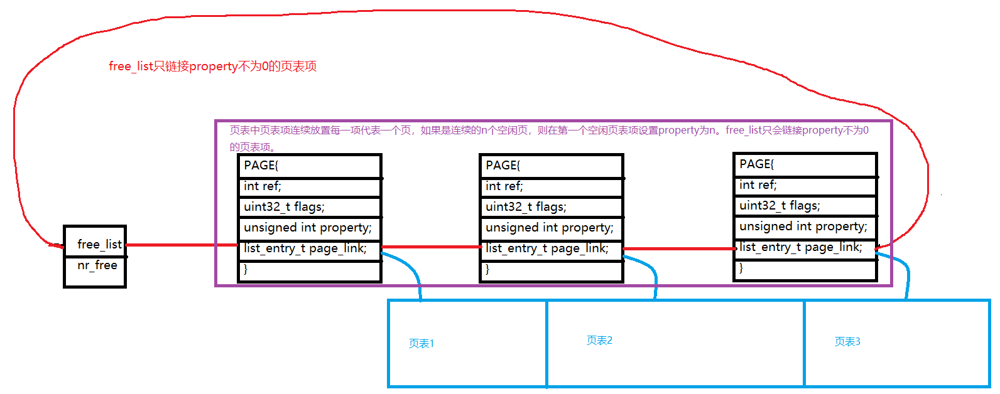

# 实验报告
## [练习0]
##### 合并lab1->lab2

## [练习1]
##### 实现 first-fit,可能会修改default_init、default_init_memmap、
##### default_alloc_pages、default_free_pages 

0. 总述  
###### 通过阅读代码发现,UCORE中是这样管理空闲块的:

###### 其实整个各个过程和CSAPP里面malloc本质上是一样的,只是通过页表来管理页信息
###### 替代了malloc里面的块首尾的描述块:改动的函数如下

1. default_init
```C
static void
default_init(void) {
    /**
     * 初始化双向列表,
     * free_list是头结点,nr_free是空闲块数目
     * 似乎first_fit不需要改变该函数
     * */
}

```

2. default_init_memmap
```C
static void
default_init_memmap(struct Page *base, size_t n)
{
    assert(n > 0);
    struct Page *p = base;
    for (; p != base + n; p++)
    {
        //非保留页才可以被分配使用
        assert(PageReserved(p));
        //设置页属性
        p->flags = p->property = 0;
        //空闲页: ref位为0
        set_page_ref(p, 0);
    }
    //第一页需要标记总页数
    base->property = n;
    //第一页为保留页
    SetPageProperty(base);
    //总空闲页+n
    nr_free += n;
    //使用 `p->page_link` 将该页面链接到`free_list`
    list_add(&free_list, &(base->page_link));
}
```

3. default_alloc_pages
```C
static struct Page *
default_alloc_pages(size_t n)
{
    assert(n > 0);
    if (n > nr_free)
    {
        return NULL;
    }
    struct Page *page = NULL;
    list_entry_t *le = &free_list;
    while ((le = list_next(le)) != &free_list)
    { //遍历双向链表
        struct Page *p = le2page(le, page_link);
        if (p->property >= n)
        { //空闲块大小页个数＞=n,则分配,是否需要设置ref?
            page = p;
            break;
        }
    }
    if (page != NULL)
    {
        le = list_next(le);
        list_del(&(page->page_link)); //从空闲列表中删除page
        if (page->property > n)
        { //并将未分配的页合并到空闲链表中
            struct Page *p = page + n;
            p->property = page->property - n;
            list_add_before(le, &(p->page_link));
            //表示该页的Property是有效的
            SetPageProperty(p);
            //ClearPageReserved(p);
        }
        nr_free -= n;

        /**
         * Some flag bits of this page should be set as the following: 
         * `PG_reserved = 1`, `PG_property = 0`.
         * reserved置1表示这些页面已经分配,PG_property置0表示property无效
         * */
        //SetPageReserved(page);
        ClearPageProperty(page);
    }
    return page;
}

```

4. default_free_pages
```C
static void
default_free_pages(struct Page *base, size_t n)
{
    assert(n > 0);
    struct Page *p = base;
    //块的释放:标志清0,引用数置0,property重新置n,工作和Init的差不多
    for (; p != base + n; p++)
    {
        assert(!PageReserved(p) && !PageProperty(p));
        p->flags = 0;
        set_page_ref(p, 0);
    }
    base->property = n;
    SetPageProperty(base);
    list_entry_t *le = list_next(&free_list);
    while (le != &free_list)
    { /**
       * 新释放的块可能在当前某个空闲块的前后,遍历寻找
       * 找到之后就进行合并,注意前后的区别:低地址块在前
       **/
        p = le2page(le, page_link);
        le = list_next(le);
        if (base + base->property == p)
        {
            base->property += p->property;
            ClearPageProperty(p);
            list_del(&(p->page_link));
            /**
             * 可能会出现释放的块夹杂在两个空闲块之间 
             * */
            if ((p=le2page(le, page_link)) == (base + base->property))
            {
                base->property += p->property;
                ClearPageProperty(p);
                list_del(&(p->page_link));
                le = list_next(le);
            }
        }
        else if (p + p->property == base)
        {
            p->property += base->property;
            ClearPageProperty(base);
            base = p;
            list_del(&(p->page_link));
        }
    }
    nr_free += n;
    list_add_before(le, &(base->page_link));
}

```


## [练习2] 实现寻找虚拟地址对应的页表项

0. 页表的重要内容


1. 修改get_pte()
```C
pte_t *
get_pte(pde_t *pgdir, uintptr_t la, bool create) {
    pde_t *pde = &pgdir[PDX(la)];               //找到相应的pde
    if(!(*pde & PTE_P)){                        //若页面无效
        if(create == NULL) return NULL;         //create为0表示不创建,此时返回null
        struct Page *page = alloc_page();       //create为1则分配一个页面
        if(page == NULL) return NULL;           //内存不足retunr null
        set_page_ref(page, 1);                  //随后设置ref为1
        pde_t *pa = page2pa(page);              //并获取页面对应的物理地址
        pde_t *va = KADDR(pa);                  //得到对应的内核虚地址
        memset(va, 0, PGSIZE);                  //初始化页面
        *pde = pa | PTE_P | PTE_W | PTE_U;      //将pa放入pde中并设置标志位
    }
    return &pde[PTX(la)];                       //返回pte所在的内核虚地址
}
```

2. 请描述页目录项和页表项中每个组成部分的含义以及对 ucore 而言的潜在用处。
    答:如图可知

3. 如果 ucore 执行过程中访问内存，出现了页访问异常，请问硬件要做哪些事情?
    答:访问内存异常后，要压入当前的线性地址到cr2中，然后执行中断服务例程。

## [练习3] 释放某虚地址所在的页并取消对应二级页表项的映射  
当释放一个包含某虚地址的物理内存页时，需要让对应此物理内存页的管理数据结构 Page 做相关的清除处理，
使得此物理内存页成为空闲；另外还需把表示虚地址与物理地址对应关系的二级页表项清除。  

0. 总述
    比练习2简单多了,按照流程来就行

1. 修改page_remove_pte
```C
    static inline void
page_remove_pte(pde_t *pgdir, uintptr_t la, pte_t *ptep) {
    if((pgdir[PDX(la)] & PTE_P)&&(*ptep & PTE_P)){      //是否有效
        struct Page *page = pte2page(*ptep);            //找到对应页面
        page_ref_dec(page);                             //引用自减
        if(page->ref==0){                               //引用为0
            free_page(page);                            //释放页面
        }
        tlb_invalidate(pgdir, la);                      //刷新tlb
        *ptep = NULL;                                   //清空页表项
    }
}
```
## [Challenge 1] buddy system（伙伴系统）分配算法

## [Challenge 2] 任意大小的内存单元 slub 分配算法

