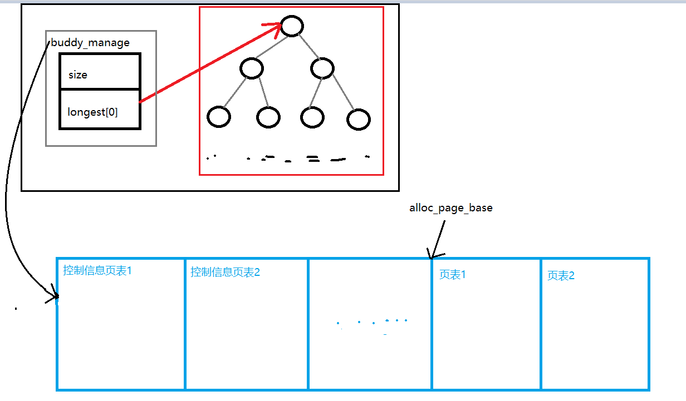

# 实验报告
## [练习0]
##### 合并lab1->lab2

## [练习1]
##### 实现 first-fit,可能会修改default_init、default_init_memmap、
##### default_alloc_pages、default_free_pages 

0. 总述  
###### 通过阅读代码发现,UCORE中是这样管理空闲块的:

###### 其实整个各个过程和CSAPP里面malloc本质上是一样的,只是通过页表来管理页信息
###### 替代了malloc里面的块首尾的描述块:改动的函数如下

1. default_init
```C
static void
default_init(void) {
    /**
     * 初始化双向列表,
     * free_list是头结点,nr_free是空闲块数目
     * 似乎first_fit不需要改变该函数
     * */
}

```

2. default_init_memmap
```C
static void
default_init_memmap(struct Page *base, size_t n)
{
    assert(n > 0);
    struct Page *p = base;
    for (; p != base + n; p++)
    {
        //非保留页才可以被分配使用
        assert(PageReserved(p));
        //设置页属性
        p->flags = p->property = 0;
        //空闲页: ref位为0
        set_page_ref(p, 0);
    }
    //第一页需要标记总页数
    base->property = n;
    //第一页为保留页
    SetPageProperty(base);
    //总空闲页+n
    nr_free += n;
    //使用 `p->page_link` 将该页面链接到`free_list`
    list_add(&free_list, &(base->page_link));
}
```

3. default_alloc_pages
```C
static struct Page *
default_alloc_pages(size_t n)
{
    assert(n > 0);
    if (n > nr_free)
    {
        return NULL;
    }
    struct Page *page = NULL;
    list_entry_t *le = &free_list;
    while ((le = list_next(le)) != &free_list)
    { //遍历双向链表
        struct Page *p = le2page(le, page_link);
        if (p->property >= n)
        { //空闲块大小页个数＞=n,则分配,是否需要设置ref?
            page = p;
            break;
        }
    }
    if (page != NULL)
    {
        le = list_next(le);
        list_del(&(page->page_link)); //从空闲列表中删除page
        if (page->property > n)
        { //并将未分配的页合并到空闲链表中
            struct Page *p = page + n;
            p->property = page->property - n;
            list_add_before(le, &(p->page_link));
            //表示该页的Property是有效的
            SetPageProperty(p);
            //ClearPageReserved(p);
        }
        nr_free -= n;

        /**
         * Some flag bits of this page should be set as the following: 
         * `PG_reserved = 1`, `PG_property = 0`.
         * reserved置1表示这些页面已经分配,PG_property置0表示property无效
         * */
        //SetPageReserved(page);
        ClearPageProperty(page);
    }
    return page;
}

```

4. default_free_pages
```C
static void
default_free_pages(struct Page *base, size_t n)
{
    assert(n > 0);
    struct Page *p = base;
    //块的释放:标志清0,引用数置0,property重新置n,工作和Init的差不多
    for (; p != base + n; p++)
    {
        assert(!PageReserved(p) && !PageProperty(p));
        p->flags = 0;
        set_page_ref(p, 0);
    }
    base->property = n;
    SetPageProperty(base);
    list_entry_t *le = list_next(&free_list);
    while (le != &free_list)
    { /**
       * 新释放的块可能在当前某个空闲块的前后,遍历寻找
       * 找到之后就进行合并,注意前后的区别:低地址块在前
       **/
        p = le2page(le, page_link);
        le = list_next(le);
        if (base + base->property == p)
        {
            base->property += p->property;
            ClearPageProperty(p);
            list_del(&(p->page_link));
            /**
             * 可能会出现释放的块夹杂在两个空闲块之间 
             * */
            if ((p=le2page(le, page_link)) == (base + base->property))
            {
                base->property += p->property;
                ClearPageProperty(p);
                list_del(&(p->page_link));
                le = list_next(le);
            }
        }
        else if (p + p->property == base)
        {
            p->property += base->property;
            ClearPageProperty(base);
            base = p;
            list_del(&(p->page_link));
        }
    }
    nr_free += n;
    list_add_before(le, &(base->page_link));
}

```


## [练习2] 实现寻找虚拟地址对应的页表项

0. 页表的重要内容


1. 修改get_pte()
```C
pte_t *
get_pte(pde_t *pgdir, uintptr_t la, bool create) {
    pde_t *pde = &pgdir[PDX(la)];               //找到相应的pde
    if(!(*pde & PTE_P)){                        //若页面无效
        if(create == NULL) return NULL;         //create为0表示不创建,此时返回null
        struct Page *page = alloc_page();       //create为1则分配一个页面
        if(page == NULL) return NULL;           //内存不足retunr null
        set_page_ref(page, 1);                  //随后设置ref为1
        pde_t *pa = page2pa(page);              //并获取页面对应的物理地址
        pde_t *va = KADDR(pa);                  //得到对应的内核虚地址
        memset(va, 0, PGSIZE);                  //初始化页面
        *pde = pa | PTE_P | PTE_W | PTE_U;      //将pa放入pde中并设置标志位
    }
    return &pde[PTX(la)];                       //返回pte所在的内核虚地址
}
```

2. 请描述页目录项和页表项中每个组成部分的含义以及对 ucore 而言的潜在用处。
    答:如图可知

3. 如果 ucore 执行过程中访问内存，出现了页访问异常，请问硬件要做哪些事情?
    答:访问内存异常后，要压入当前的线性地址到cr2中，然后执行中断服务例程。

## [练习3] 释放某虚地址所在的页并取消对应二级页表项的映射  
当释放一个包含某虚地址的物理内存页时，需要让对应此物理内存页的管理数据结构 Page 做相关的清除处理，
使得此物理内存页成为空闲；另外还需把表示虚地址与物理地址对应关系的二级页表项清除。  

0. 总述
    比练习2简单多了,按照流程来就行

1. 修改page_remove_pte
```C
    static inline void
page_remove_pte(pde_t *pgdir, uintptr_t la, pte_t *ptep) {
    if((pgdir[PDX(la)] & PTE_P)&&(*ptep & PTE_P)){      //是否有效
        struct Page *page = pte2page(*ptep);            //找到对应页面
        page_ref_dec(page);                             //引用自减
        if(page->ref==0){                               //引用为0
            free_page(page);                            //释放页面
        }
        tlb_invalidate(pgdir, la);                      //刷新tlb
        *ptep = NULL;                                   //清空页表项
    }
}
```
## [Challenge 1] buddy system（伙伴系统）分配算法
0. 设计
---
(0)Ideas  
    通过阅读相关材料,初步想法是通过一个`二叉树(数组)`维护内存块列表,列表功能是加快寻找块的速度,暂时不做页面控制信息的改变可能需要对
    `default_init`, `default_init_memmap`, `default_alloc_pages`, `default_free_pages`做出修改, 同时需要定义一些相关的`宏`来方便操作。
    这里突然有一个小疑问：传入的struct Page *base具体地址是哪？在哪传入这个地址的
    `buddy的结构`
    
(1)Data structure
```C
struct buddy2{
    buddy_size size;               //表明管理内存的总单元数目,在初始化时分配
    buddy_node_list longest[0];    //表明所对应的内存块的空闲单位
}
```
struct buddy2 *buddy_manager;
struct Page   *alloc_page_base;     //实际分配页面的起始页面地址
struct Page   *manage_base;         //控制信息存储页面

(2)MACROs and DEFINEs and functions
```C
//Data Structure Flags
#define buddy_node_list unsigned;
#define buddy_size unsigned;

//relation operator
#define buddy_left_child(i)    ((i+1)*2-1)    
#define buddy_right_child(i)   ((i+1)*2)
#define buddy_parent(i)        (i==0?0:(i-1)/2)

//assistants
#define IS_POWER_OF_2(i)       ((i!=0) && (((i-1)&i)==0)) 
#define MAX(a,b)               ((a)>=(b)?(a):(b))

unsigned round_down(unsigned n){ //n至少为1;
    unsigned i = 1;
    for(;n >> i;i++);
    return 1 << (i-1);
}
unsigned round_up(unsigned n){  //n不能超过0x8000 0000;
    unsigned i = 1;
    for(;n >> i;i++);
    return 1 << i;
}
```

(3)init & alloc & free
    init: 需要对buddy_manager进行初始化,用初始的几个页面存储控制信息:`size`和`longest[]`,对`size=2^k`个页,
    需要存储`2size-1`个`结点`,外加一个`size`,  则需要分配的总空间为`2` * `size` * `sizeof(unsigned)`;
    alloc: 需要在原来代码上,将寻找空闲块的操作改为通过遍历二叉树来寻找合适结点,改变`longest[i]`的内容后返回页 
    free：先找到分配出去的页面编号offset,随后对`longest[]`进行合并  
    留坑: 先不对页面控制信息进行更改
(4)Check
    Check需要验证buddy的正确性:  
    1.分配时的分配的内存块是否是最合适的?
    2.释放时,合并是否正确?
    3.所有块是否按照2的次方对齐?
    4.分配后释放,应该和原来的一样

---

1. buddy_init
```C
static void buddy_init(){
    //不需要做什么东西,只是为了适应接口
}
```

2. buddy_init_memmap
```C
static void
init_buddy_manager(struct Page *base, size_t n){
    if(!IS_POWER_OF_2(n)) n = round_down(n);
    buddy_manager->size = n;
    unsigned node_count = 2 * buddy_manager->size - 1;
    unsigned size_count = (node_count+1) * sizeof(unsigned);
    buddy_manager = page2kva(base);
    manage_base = base;
    alloc_page_base = base + ((size_count - 1) / PGSIZE + 1);

    buddy_size node_size = n * 2;
    for(unsigned i = 0; i < node_count; i++){
        if(!IS_POWER_OF_2(i))
            node_size /= 2;
        buddy_manager->longest[i] = node_size;
    }
}
static void
buddy_init_memmap(struct Page *base, size_t n)
{
    assert(n > 0);                     //n=2^k; k>=0
    struct Page *p = base;
    for (; p != base + n; p++)
    {
        //非保留页才可以被分配使用
        assert(PageReserved(p));
        //设置页属性
        p->flags = p->property = 0;
        //空闲页: ref位为0
        set_page_ref(p, 0);
    }
    
    //buddy初始化
    init_buddy_manager(base,n);
}
```

3. buddy_alloc_pages
```C
static struct Page *
buddy_alloc_pages(size_t n)
{
    assert(n > 0);
    if(!IS_POWER_OF_2(n)) n = round_up(n);
    if(n > buddy_manager->longest[0]) return NULL; 

    //offset最终取low,high=n充当边界,同时保证计算low时向上取整
    unsigned offset, low = 0, high = n;
    
    //找到n=buddy_manager->longest[i],同时二分计算offset
    buddy_size i = 0;
    while(n != buddy_manager->longest[i]){
        if(n<=buddy_manager->longest[buddy_left_child(i)]){
            i = buddy_left_child(i);
            low = (high + low)/2;
        }else{
            i = buddy_right_child(i);
            high = (high + low)/2;
        }
    }
    //找到实际分配的下标位置
    while(buddy_manager->longest[i] != 1){
        if(n == buddy_manager->longest[buddy_left_child(i)]){
            i = buddy_left_child(i);
            low = (high + low)/2;
        }
        else if(n == buddy_manager->longest[buddy_right_child(i)]){
            i = buddy_right_child(i);
            high = (high + low)/2;
        }
        else
            break;
    }
    offset = low;

    buddy_manager->longest[i] = 0;
    //自底往上更改longest[]
    unsigned j = i;
    while(j){
        j = buddy_manager_parent(j);
        buddy_manager->longest[j] = MAX(buddy_manager->longest[buddy_left_child(j)],
                                    buddy_manager->longest[buddy_right_child(j)]);
    }

    /*获取page*/
    struct Page *page = alloc_page_base + offset;   
    //页的控制信息是否需要更新？
    //直接对page进行更改
    // SetPageProperty(page);
    // ClearPageProperty(page);
    return page;
}

```

4. buddy_free_pages
```C
static void
buddy_free_pages(struct Page *base, size_t n)
{
    assert(n > 0 && n <= buddy_manager->size);
    if(!IS_POWER_OF_2(n)) n = round_up(n);
    unsigned offset = base - alloc_page_base;
    unsigned i = offset;
    /**
     * 已经分配的是当前分支可分配的最深的结点,其子结点不可能被分配。
     * 如果两个子节点都是满的,父节点归满,满的条件必须是子节点当前大小==node_size
     * 否则父节点值为最大子结点中值较大的一个;
     **/
    buddy_manager->longest[i] = n;
    size_t node_size = n;
    while(i){
        i = buddy_manager_parent(i);
        if(node_size == n){
            if(buddy_manager->longest[buddy_left_child(i)] ==
                buddy_manager->longest[buddy_right_child(i)])
                {
                    buddy_manager->longest[i] = 2*n;
                    n*=2;
                }
        }
        else{
            buddy_manager->longest[i] = MAX(buddy_manager->longest[buddy_left_child(i)],
                                        buddy_manager->longest[buddy_right_child(i)]);
        }
        node_size *= 2;
    }
    //暂时不做页面控制信息的改变
}

```

5. buddy_nr_free_pages
```C
static size_t
buddy_nr_free_pages(void) {
    return buddy_manager->size;
}
```

6. buddy_check
```C
/**
 * 验证宏/函数的操作是否正确
 **/
static void
macro_check(){  
    //check relation operator
    assert(buddy_left_child(0) == 1);
    assert(buddy_left_child(1) == 3);
    assert(buddy_left_child(2) == 5);
    assert(buddy_right_child(0) == 2);  
    assert(buddy_right_child(1) == 4);
    assert(buddy_right_child(2) == 6);
    
    assert(buddy_parent(0) == 0);        
    assert(buddy_parent(1) == 0);        
    assert(buddy_parent(2) == 0);        
    assert(buddy_parent(3) == 1);        
    assert(buddy_parent(4) == 1);        
    assert(buddy_parent(5) == 2);        
    assert(buddy_parent(6) == 2);        

    //check assistants
    assert(IS_POWER_OF_2(0) == 0);       
    assert(IS_POWER_OF_2(1) == 1);       
    assert(IS_POWER_OF_2(0xffffffff) == 0);       
    assert(IS_POWER_OF_2(0x80000000) == 1);
    assert(IS_POWER_OF_2(0xf1234567) == 0);
    assert(IS_POWER_OF_2(0x00100000) == 1);

    assert(MAX(0,0) == 0);
    assert(MAX(0xffffffff,0) == 0xffffffff);
    assert(MAX(0,0xffffffff) == 0xffffffff);
    assert(MAX(0xff,0ff1) == 0xff1);
    
    assert(round_up(0) == 1);
    assert(round_up(1) == 1);
    assert(round_up(0x7fffffff) == 0x80000000);
    assert(round_up(0x80000000) == 0x80000000);
    assert(round_up(0x01234567) == 0x02000000);

    assert(round_down(1) == 1);
    assert(round_down(0x8fffffff) == 0x80000000);
    assert(round_down(0x80000000) == 0x80000000);
    assert(round_down(0x01234567) == 0x01000000);
}

/**
 * 遍历检查longest[]
 **/
static void
longest_check(){
    size_t max_parent = 2 * (buddy_manager->size - 1) - 1;
    size_t i = 0;
    size_t node_size = buddy_manager->size;
    for(; i < max_parent; i++,node_size/=2){
        size_t left = buddy_left_child(i);
        size_t right = buddy_right_child(i);
        if(left == right){
           if((left << 1) ==  node_size)){
               assert(buddy_manager->longest[i] == node_size);
           }
        }
        else{
            assert(buddy_manager->longest[i] == 
                MAX(buddy_manager->longest[left],buddy_manager->longest[right]));
        }
    }
}

/**
 * 验证init后控制结构的信息是否正确
 **/
static void
manager_check() {
    unsigned i;
    buddy_init_memmap(manage_base,1024);
    assert(buddy_manager->size == 1024);
    i = alloc_page_base - manage_base;
    assert(i == 2);
    buddy_init_memmap(manage_base,1026);
    assert(buddy_manager->size == 1024);
    i = alloc_page_base - manage_base;
    assert(i == 2);
}

/**
 * 验证alloc和free的正确性
 **/
static void
alloc_check(){
    // 前面这一段是原来的测试
    // Build buddy system for test
    size_t buddy_alloc_size = buddy_manager->size;
    for (struct Page *p = manage_base; p < manage_base + 1026; p++)
        SetPageReserved(p);
    buddy_init();
    buddy_init_memmap(manage_base, 1026);

    // Check allocation
    struct Page *p0, *p1, *p2, *p3;
    p0 = p1 = p2 = NULL;
    assert((p0 = alloc_page()) != NULL);
    assert((p1 = alloc_page()) != NULL);
    assert((p2 = alloc_page()) != NULL);
    assert((p3 = alloc_page()) != NULL);
    cprintf("p0 - base = %d, p1 - base = %d. p2 - base = %d, p3 - base = %d\n", \
    p0 - alloc_page_base, p1 - alloc_page_base, p2 - alloc_page_base, p3 - alloc_page_base);
    assert(p0 + 1 == p1);
    assert(p1 + 1 == p2);
    assert(p2 + 1 == p3);
    assert(page_ref(p0) == 0 && page_ref(p1) == 0 && page_ref(p2) == 0 && page_ref(p3) == 0);

    assert(page2pa(p0) < npage * PGSIZE);
    assert(page2pa(p1) < npage * PGSIZE);
    assert(page2pa(p2) < npage * PGSIZE);
    assert(page2pa(p3) < npage * PGSIZE);


    // Check release
    free_page(p0);
    free_page(p1);
    free_page(p2);
    cprintf("p3 - base = %d\n",  p3 - alloc_page_base);
    assert((p1 = alloc_page()) != NULL);
    assert((p0 = alloc_pages(2)) != NULL);
    cprintf("p0 - base = %d, p1 - base = %d\n", p0 - alloc_page_base, p1 - alloc_page_base);
    assert(p0 + 2 == p1);

    free_pages(p0, 2);
    free_page(p1);
    free_page(p3);

    struct Page *p;
    assert((p = alloc_pages(4)) == p0);

    //测试alloc和free
    unsigned *testA = buddy_alloc_pages(70);
    longest_check();
    unsigned *testB = buddy_alloc_pages(35);
    longest_check();
    unsigned *testC = buddy_alloc_pages(80);
    longest_check();
    buddy_free_pages(testA,70);
    longest_check();
    unsigned *testD = buddy_alloc_pages(60);
    longest_check();
    unsigned *testE = buddy_alloc_pages(64);
    unsigned *testF = buddy_alloc_pages(64);
    buddy_free_pages(testF,64);
    longest_check();
    buddy_free_pages(testD,60);
    longest_check();
    buddy_free_pages(testB,35);
    longest_check();
    buddy_free_pages(testE,64);
    longest_check();
    buddy_free_pages(testC,80);
    longest_check();
    // Restore buddy system
    for (struct Page *p = manage_base; p < manage_base + buddy_alloc_size; p++)
        SetPageReserved(p);
    buddy_init();
    buddy_init_memmap(manage_base, buddy_alloc_size);
}

static void
buddy_check()
{
    macro_check();
    manager_check();
    alloc_check();
}

```

7. pmm_manager
```C
/**
 * 修改pmm_manager框架
 **/
const struct pmm_manager buddy_pmm_manager = {
    .name = "buddy_pmm_manager",
    .init = buddy_init,
    .init_memmap = buddy_init_memmap,
    .alloc_pages = buddy_alloc_pages,
    .free_pages = buddy_free_pages,
    .nr_free_pages = buddy_nr_free_pages,
    .check = buddy_check,
};
```
## [Challenge 2] 任意大小的内存单元 slub 分配算法

